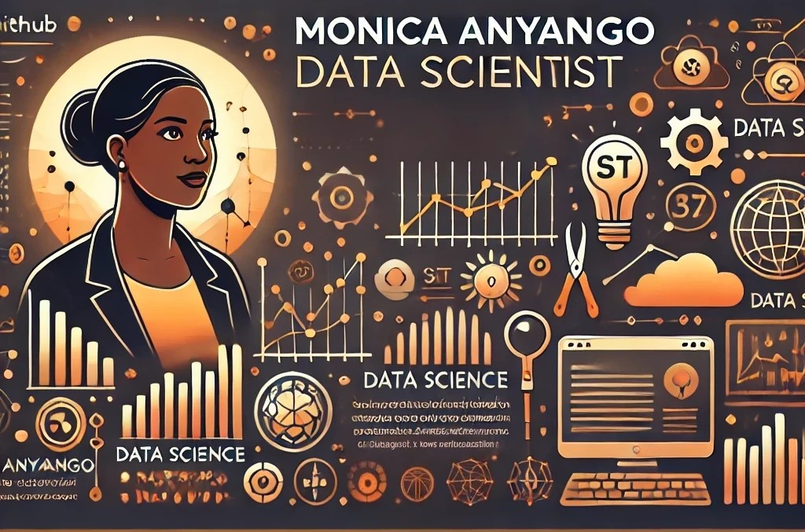

# Hi, I'm Monica 👋🏾 👩🏾‍💻

I'm a data scientist and graduate architect passionate about leveraging analytical skills to innovate across architecture and beyond. I specialize in creating insights from complex datasets, building machine learning models, and designing solutions that have a tangible impact. Some technologies and tools I enjoy working with include Python, SQL, Tableau, and PowerBI. I'm actively exploring how data science can be applied in diverse fields, from real estate to environmental sustainability.

---

## 📊 GitHub Stats

---

## 👩🏾‍💻 About Me
- 🎓 Graduate Architect turned Data Scientist, passionate about using data to solve real-world problems.
- 📈 Skilled in Python, SQL, Tableau, and PowerBI with hands-on experience in machine learning and predictive modeling.
- 🌍 Exploring data-driven solutions for environmental sustainability and real estate innovation.
- 💼 Open to opportunities in data analysis, machine learning, and data engineering.

---

## 🛠️ Skills

---

## 📌 Pinned Projects

### 🌟 **Employee Attrition Prediction**
- A machine learning model to predict employee turnover, leveraging classification algorithms with 85% F1-score.
- Tools: Python, Scikit-Learn, Matplotlib, Tableau.

### 🚀 **Customer Segmentation Analysis**
- Performed clustering analysis to segment customers and recommend marketing strategies.
- Tools: Python, KMeans, Seaborn.

### 🔥 **Real Estate Price Prediction**
- Built a regression model to predict house prices based on location and features, achieving 90% R² score.
- Tools: Python, XGBoost, PowerBI.

---

## 📜 Certifications
- [Data Science Professional Certificate](https://example.com) - IBM
- [SQL for Data Science](https://example.com) - Coursera
- [Machine Learning](https://example.com) - Andrew Ng (Stanford University)

---

## ✍️ Blogs & Articles
- [How to Build a Machine Learning Model](https://medium.com/@monicaanyango)
- [SQL Best Practices for Data Analysis](https://medium.com/@monicaanyango)

---

## 🌍 Find Me Around the Web

- Sharing my journey in data science and architecture on [LinkedIn](https://www.linkedin.com/in/monica-anyango-data-scientist) 💼  
- Building projects and showcasing my code on [GitHub](https://github.com/MONISH254) 🖥️  
- Showcasing data visualizations on Tableau and PowerBI  
- Learning and experimenting with new tools and technologies to stay at the forefront of innovation  

---

## 📄 Resume
[Click here to view my resume](https://example.com)

---

## 🌟 Visitors Count

